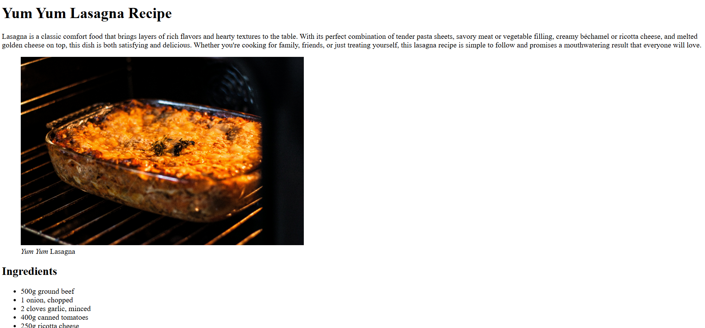

# Recipe Page

In this lab I applied working with basic html elements such as:

- Headings
- Paragraphs
- Images
- Links
- Lists

## Objective

The goal of this lab was to get hands-on practice with foundational HTML elements and understand how to structure a simple webpage.

## Notes

- Learned how to properly structure a page with headings, paragraphs, and lists.

## Screenshot

