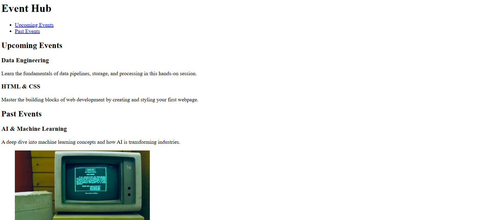

# Event Hub

An event hub page made to apply semantic html elements such as `nav`, `header`, `section`, and `article`.

The goal of this lab was to get hands on practice with using semantic hmtl elements to help structure a page.

I also used lorem ipsum as a text placeholder.

# Screenshot

