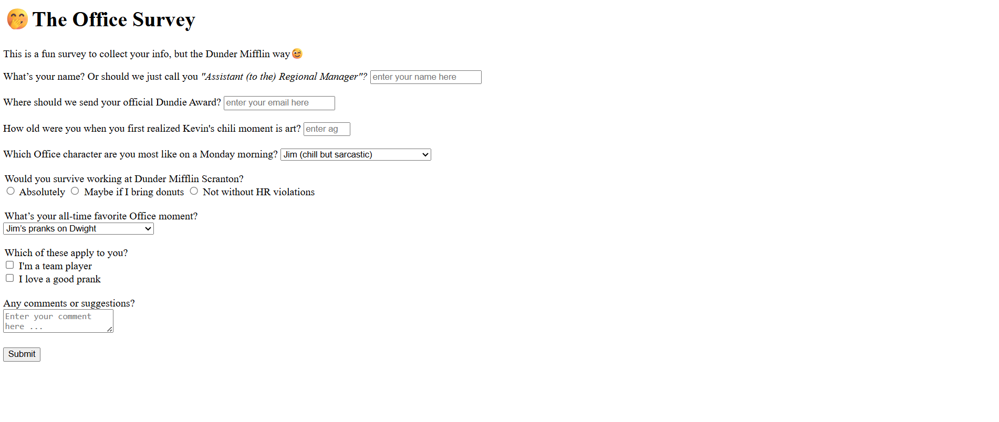

# Fun Survey Form

I created this form based on The Office humour. I love this show, so why not make a form that is fun and interactive...

The objective of this project was to practice working with the `label` element, the different `input` elements, the `required` attribute, and much more.

For this project I used different input types, I learned to give appropriate attributes to `label`, `form`, and `input` elements,and I also learned the `select` element.

# Screenshot

