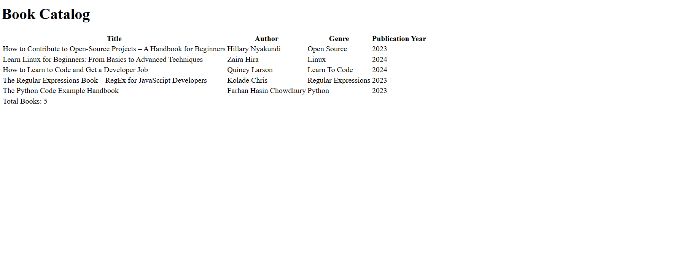

# Book Catalog Table

This is a table that contains book data.

This project was built to apply the `table` element. It uses the the basic table structure: `thead`, `tbody` and `tfoot`.

# Screenshot

