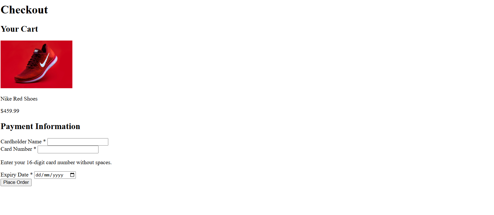

# Checkout Page

This project is a simple **Checkout Page** built using basic HTML to simulate a small online store’s checkout process. It demonstrates how to structure web content semantically and how to include accessibility features for better user experience.

# Objective

The objective of this project is to:

- Practice using semantic HTML elements such as `<section>`, `<form>`, `<label>`, and `<input>`.
- Understand and apply **accessibility attributes** like `aria-describedby` and `aria-hidden`.
- Create a basic structure for a checkout process with clear sections for a shopping cart and payment information.

# Notes

- The page includes one main heading (`<h1>`) titled **Checkout**.
- It has two main sections:
  - **Your Cart** — displays product details and an image.
  - **Payment Information** — contains a form for card details.
- Required fields are marked visually with a `*` (hidden from screen readers using `aria-hidden="true"`).
- Help text is connected to the card number input using `aria-describedby`.
- This project focuses on **HTML structure and accessibility**.
- The project serves as a foundation for learning front-end form creation and web accessibility best practices.

# Screenshot

